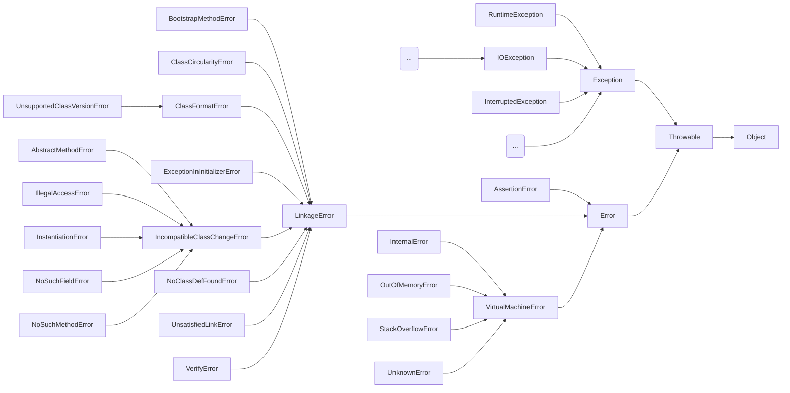

# Spring Web Application 에서 예외처리 고민

## 1. 개요

> - 발제\
> *발생하는 다양한 예외 케이스들을 어떻게 코드상에서 관리할 것인가?*\
> 예외 케이스들은 다음 두 가지 상황을 위해 효율적인 전략이 필요.\
> 각 상황에 따라 고민해볼 것

- 개발자들 간 협업
    - 문서화
- 운영환경에서의 트러블 슈팅
    - 예외 로그를 보고 편하게 트러블슈팅하기 위해서 어떤 형태로 로그를 남기는 것이 좋을 지?

---

## 2. 사전조사
### 1. 체크 예외(Check Exception)와 언체크 예외/런타임 예외 (Uncheck Exception, Runtime Exception)의 차이
```mermaid
     flowchart ^
     Throwable([Throwable]) --> Object([Object]):::Object
     Exception([Exception]) --> Throwable
     Error([Error]) --> Throwable
     RuntimeException([RuntimeException]):::RuntimeExceptionStyle --> Exception
     extendsError([... extends Error]) --> Error
     subgraph CheckedException [Checked Exception]
     extendsException([... extends Exception]):::CheckedExceptionStyle  
     end
     CheckedException:::italic --> Exception
     subgraph UncheckedException [Unchecked Exception]
       extendsRuntimeException([... extends RuntimeException]):::RuntimeExceptionStyle --> RuntimeException  
     end
     UncheckedException:::italic
     classDef default fill:#282c34,stroke:#abb2bf,stroke-width:2px,color:#abb2bf,font-family:Cascadia Code PL,font-weight:500;
     classDef Object font-weight:900;
     classDef RuntimeExceptionStyle fill:#e06c75,stroke:#2d2d34,stroke-width:2px,color:#2d2d34,font-weight:500;
     classDef CheckedExceptionStyle fill:#61afef,stroke:#2d2d34,stroke-width:2px,color:#2d2d34,font-weight:500;
     classDef italic fill:#282c34, stroke:#abb2bf,stroke-width:2px,color:#abb2bf,font-family:Cascadia Code PL,font-weight:700, font-style:italic; 
 ```

- **에러**
  - [java.lang.Error](https://docs.oracle.com/en/java/javase/17/docs/api/java.base/java/lang/Error.html)
  클래스의 하위 클래스들이다.  `Error`는 메모리가 부족하는 등과 같이 시스템이 비정상적인 상황인 경우에
  사용한다. 주로 `JVM`에서 발생시키기 때문에 애플리케이션 코드에서   잡아서는 안되며, 잡아서 대응할 수
  있는 방법도 없다. 따라서 시스템 레벨에서 특별한 작업을 하는게 아니라면 이러한 에러 처리는 하지 않아도 
  된다.\
  `// TO-DO`  (그럼 `Error`같은 시스템오류는 어떻게 대비할 것인가? jvm 모니터링 -> 메모리 증설, 
  서버 다중화, 로드밸런싱, 웹 및 DB서버 성능 튜닝, 캐시서버 도입  등등 차후에 더 찾아보도록 하겠다.) 
  [참고링크](https://markruler.github.io/posts/java/jvm-monitoring/) \
  다만, `StackOverFlowError`의 경우 재귀함수나 무한루프에 빠질 가능성이 있는 코드에 대해서는 ide가
  어느정도 가이드를 해주니 이에 유의하여 코드를 작성해야 한다.[StackOverFlowError 예제](https://www.baeldung.com/java-stack-overflow-error)

- **Checked Exception**
  - **체크 예외**(**Checked Exception**)는 `RuntimeException` 클래스를 상속받지 않은 예외 클래스입니다.
  이러한 예외는 복구 가능성이 있는 예외로, 반드시 예외를 처리하는 코드를 작성해야 합니다.
  대표적인 체크 예외로는 파일 및 버퍼 작업과 관련된 `IOException`, 데이터베이스 쿼리 실행과 관련된
  `SQLException` 등이 있습니다. 이러한 예외를 처리하기 위해서는 `try-catch` 문으로 예외를
  처리하거나 메서드에서 예외를 다시 던지도록 `throws`를 사용할 수 있습니다. 예외를 처리하지 않으면
  컴파일 에러가 발생합니다.

  - **체크 예외**는 개발자가 실수로 예외 처리를 놓치지 않도록 컴파일러가 도와주는 장점이 있습니다.
  그러나 모든 체크 예외를 처리해야 하므로 번거로울 뿐 아니라, 때로는 처리하고 싶지 않은 예외까지
  처리해야 하는 단점이 있습니다. 또한 애플리케이션 개발 중에 발생하는 예외 중 대부분은 복구가
  어려운 경우가 많습니다. 예를 들어 `SQLException`과 같은 체크 예외를 catch해도, 보통 쿼리를
  수정하고 재배포하지 않는 이상 예외를 복구하기 어렵습니다. 따라서 실제 애플리케이션 개발에서는
  대부분 언체크 예외(**Unchecked Exception**)를 사용합니다.

- **Unchecked Exception**
  - `RuntimeException` 클래스를 상속받는 예외 클래스들은 복구 가능성이 없는 예외들이므로 컴파일러가
  예외처리를 강제하지 않습니다. 그래서 언체크 예외라고 불리며, 언체크 예외는 `Error`와 마찬가지로
  에러를 처리하지 않아도 컴파일 에러가 발생하지 않습니다. 즉, 런타임 예외는 예상치 못했던 상황에서
  발생하는 것이 아니므로 굳이 예외 처리를 강제하지 않습니다. `RuntimeException`에는 대표적인
  `NullPointerException`이나 `IllegalArgumentException`과 같은 예외들이 있습니다.
  언체크 예외는 특별히 신경쓰지 않고 싶은 예외들을 모두 무시할 수 있습니다.
  그러나, 컴파일러가 예외를 잡아주지 않기 때문에, 개발자가 실수로 예외 처리를 누락할 수 있는
  단점이 있습니다.

- **참고**
  - 위에서 설명한 체크 예외와 언체크 예외의 차이를 이해하는 것은 매우 중요합니다.
  왜냐하면 스프링 프레임워크가 제공하는 선언적 트랜잭션(`@Transactional`) 내에서 에러가 발생할 때
  체크 예외는 롤백되지 않고, 언체크 예외는 롤백됩니다. 이것은 자바 언어와는 무관한 프레임워크의
  특징이므로 반드시 인식해야 합니다. (물론 옵션을 변경할 수 있습니다.)

### 2. [ 예외 처리 방법 ]
- [예외 복구](#2-1-예외-복구)
- [예외 처리 회피](#2-2-예외-처리-회피)
- [예외 전환](#2-3-예외-전환)

- #### 2-1. 예외 복구
   - 예외 상황을 파악하고 문제를 해결해서 정상 상태로 돌려놓는 것이다.
   만약 예외로 어떤 작업의 처리가 불가능하다면 다르게 작업을 처리하도록 유도함으로써 예외를
   처리하는 방법이다. 대표적으로 다른 API 호출에 실패하였을 경우, 3회 정도 retry 하여
   복구되도록 하는 것들이 있다.
- #### 2-2. 예외 처리 회피
   - 예외 처리를 직접 처리하지 않고, 자신을 호출한 곳으로 던져버리는 것이다.
   만약 해당 예외를 처리하는 것이 자신이 해야될 일이 아니라고 느껴진다면 다른 메소드에서 
   처리하도록 넘겨줄 때 사용한다. 하지만 무작정 예외를 넘겨주는 것은 무책임한 회피가 될 수
   있으므로 상황에 따라 적절하게 사용해야 한다.
- #### 2-3. 예외 전환
   - 예외 전환은 예외 회피와 마찬가지로 예외를 복구할 수 없는 상황에 사용되며,
   예외처리 회피와 다르게 적절한 예외로 변환하여 던진다는 특징이 있다. 예외 전환은 크게
   2가지 목적으로 사용된다.
     - 의미 있고 추상화된 예외로 바꾸는 경우
     - 런타임 예외로 포장하여 불필요한 처리를 줄여주는 경우
   - 내부에서 발생한 예외를 그대로 던지는 것이 적절한 의미를 부여하지 못한다면
   의미있고 추상화된 예외로 바꾸는 것이 좋다. 예를 들어 새로운 사용자를 등록하고자 할 때
   동일한 아이디가 존재하면 `SQLException`이 발생하게 된다. 하지만 이 에러를 그대로 던지면
   이를 이용하는 서비스 계층에서는 왜 예외가 발생한건지 파악이 힘들다.
   그래서 `DuplicatedUserIdException`과 같은 예외로 바꿔서 던지면 보다 확실히 의미를
   전달할 수 있으며 상황에 따라 복구작업을 시도할 수도 있을 것이다. 또한 체크 예외에 의해
   불필요하게 해주는 에러 처리가 많아진다면 이를 해결하기 위해 런타임 예외로 포장하여
   (언체크 예외로 변경하여) 불필요한 처리를 줄여줄 수 있다. 만약 복구하지 못할 예외라면
   불필요하게 체크를 할 필요가 없기 때문이다. 그래서 이러한 경우라면 애플리케이션 로직 상에서
   런타임 예외로 포장하여 던지고, 자세한 로그를 남기거나 알림을 주는 등의 방식으로 처리할 수 있다.
   내부에서 발생한 예외를 그대로 던지는 것이 적절한 의미를 부여하지 못한다면 의미 있고 추상화된
   예외로 바꾸는 것이 좋다.

### 3. [올바른 예외 처리 방법]

- #### 3.1 조치가 없는 try/catch -> 상황에 맞는 조치 진행
  - try/catch로 예외를 잡고 아무 조치도 하지 않는 것은 상당히 조심해야 한다.
  예외가 발생하여도 무관하며, 다음 라인을 실행하겠다는 의도가 있는게 아니라면 반드시 피해야 한다.
  이러한 코드는 오류가 있어서 예외가 발생했는데 그것을 무시하고 진행하는 꼴이므로 어떤 기능이
  비정상적으로 동작하거나, 메모리나 리소스가 고갈되는 등의 문제를 야기할 수 있다. 그러므로 예외를
  처리할 때에는 빈 값을 반환하는 등의 조치를 통해 상황을 적절하게 복구하거나 작업을 중단시키고
  관리자에게 이를 전달해야 한다.

- #### 3.2 무분별한 throws Exception -> 언체크 예외로 전환
  - 무책임하게 throws Exception을 하는 것도 좋지 못하다.
  왜냐하면 우리는 해당 문구를 보고 여기서 어떠한 문제가 발생할 수 있는지와 같은 의미있는 정보를
  얻을 수 없기 때문이다. 또한 이 메소드를 다른 메소드에서 사용중이라면 throws Exception이
  전파되므로 좋지 못하다. 만약 SQLException과 같이 복구가 불가능한 예외들이라면 기계적으로
  throws를 던지지 않고 가능한 빨리 언체크/런타임 예외로 전환해주는 것이 좋다.


## 3. 스프링의 다양한 예외처리 방법

### 3.1. 스프링의 기본적인 예외 처리 방법
Spring이 제공하는 다양한 예외 처리 방법들을 살펴보기 전에, 먼저 우리가 개발한 Controller에서 
발생한 예외를 Spring은 기본적으로 어떻게 처리하고 있는지 살펴보도록 하자. 아래의 내용들은
SpringBoot를 기반으로 설명된다.
- [ Spring의 기본적인 예외 처리 방식(SpringBoot) ]\
예를 들어 우리가 만든 다음과 같은 컨트롤러가 있다고 하자.
```java
@RestController
@RequiredArgsConstructor
public class ProductController {

    private final ProductService productService;
  
    @GetMapping("/product/{id}")
    public Response getProduct(@PathVariable String id){
        return productService.getProduct(id);
    }
}
```
getProduct에서 NoSuchElementFoundException 예외가 발생했다면 우리는 접속한 환경에 따라 다른 에러 처리를 받게 될 것이다. 만약 우리가 웹페이지로 접속했다면 다음과 같은 whiltelabel 에러 페이지를 반환받는다.\
Spring은 만들어질 때(1.0)부터 에러 처리를 위한 BasicErrorController를 구현해두었고, 스프링 부트는 예외가 발생하면 기본적으로 /error로 에러 요청을 다시 전달하도록 WAS 설정을 해두었다. 그래서 별도의 설정이 없다면 예외 발생 시에 BasicErrorController로 에러 처리 요청이 전달된다. 참고로 이는 스프링 부트의 WebMvcAutoConfiguration를 통해 자동 설정이 되는 WAS의 설정이다.
여기서 요청이 /error로 다시 전달된다는 부분에 주목해야 한다. 일반적인 요청 흐름은 다음과 같이 진행된다.

> WAS(톰캣) -> 필터 -> 서블릿(디스패처 서블릿) -> 인터셉터 -> 컨트롤러

그리고 컨트롤러 하위에서 예외가 발생하였을 때, 별도의 예외 처리를 하지 않으면 WAS까지 에러가 전달된다. 그러면 WAS는 애플리케이션에서 처리를 못하는 예와라 exception이 올라왔다고 판단을 하고, 대응 작업을 진행한다.

> 컨트롤러(예외발생) -> 인터셉터 -> 서블릿(디스패처 서블릿) -> 필터 -> WAS(톰캣)

WAS는 스프링 부트가 등록한 에러 설정(/error)에 맞게 요청을 전달하는데, 이러한 흐름을 총 정리하면 다음과 같다.

> WAS(톰캣) -> 필터 -> 서블릿(디스패처 서블릿) -> 인터셉터 -> 컨트롤러\
> -> 컨트롤러(예외발생) -> 인터셉터 -> 서블릿(디스패처 서블릿) -> 필터 -> WAS(톰캣)\
> -> WAS(톰캣) -> 필터 -> 서블릿(디스패처 서블릿) -> 인터셉터 -> 컨트롤러(BasicErrorController)

기본적인 에러 처리 방식은 **결국 에러 컨트롤러를 한번 더 호출**하는 것이다. 그러므로 필터나 인터셉터가 다시 호출될 수 있는데, 이를 제어하기 위해서는 별도의 설정이 필요하다. 서블릿은 dispatcherType로 요청의 종류를 구분하는데, 일반적인 요청은 REQUEST이며 에러 처리 요청은 ERROR이다. 필터는 서블릿 기술이므로 필터 등록(FilterRegistrationBean) 시에 호출될 dispatcherType 타입을 설정할 수 있고, 별도의 설정이 없다면 REQUEST일 경우에만 필터가 호출된다. 하지만 인터셉터는 스프링 기술이므로 dispatcherType을 설정할 수 없어 URI 패턴으로 처리가 필요하다.

스프링 부트에서는 WAS까지 직접 제어하게 되면서 이러한 WAS의 에러 설정까지 가능해졌다. 또한 이는 요청이 2번 생기는 것은 아니고, 1번의 요청이 2번 전달되는 것이다. 그러므로 클라이언트는 이러한 에러 처리 작업이 진행되었는지 알 수 없다.

### 3.2. BasicErrorController의 동작 및 에러 속성들
BasicErrorController는 accept 헤더에 따라 에러 페이지를 반환하거나 에러 메세지을 반환한다. 에러 경로는 기본적으로 /error로 정의되어 있으며 properties에서 server.error.path로 변경할 수 있다.
```java
@Controller
@RequestMapping("${server.error.path:${error.path:/error}}")
public class BasicErrorController extends AbstractErrorController {

    private final ErrorProperties errorProperties;
    /*...*/

    @RequestMapping(produces = MediaType.TEXT_HTML_VALUE)
    public ModelAndView errorHtml(HttpServletRequest request, HttpServletResponse response) {
        /*...*/
    }

    @RequestMapping
    public ResponseEntity<Map<String, Object>> error(HttpServletRequest request) {
        /*...*/
        return new ResponseEntity<>(body, status);
    }
    
    /*...*/
}
```

errorHtml()과 error()는 모두 getErrorAttributeOptions를 호출해 반환할 에러 속성을 얻는데, 기본적으로 DefaultErrorAttributes로부터 반환할 정보를 가져온다. DefaultErrorAttributes는 전체 항목들에서 설정에 맞게 불필요한 속성들을 제거한다.

- timestamp: 에러가 발생한 시간
- status: 에러의 Http 상태
- error: 에러 코드
- path: 에러가 발생한 uri
- exception: 최상위 예외 클래스의 이름(설정 필요)
- message: 에러에 대한 내용(설정 필요)
- errors: BindingExecption에 의해 생긴 에러 목록(설정 필요)
- trace: 에러 스택 트레이스(설정 필요)

```json
{
    "timestamp": "2021-12-31T03:35:44.675+00:00",
    "status": 500,
    "error": "Internal Server Error",
    "path": "/product/5000"
}
```

위는 기본 설정으로 받는 에러 응답인데, 나름 잘 갖추어져 있지만 클라이언트 입장에서 유용하지 못하다.
클라이언트는 “Item with id 5000 not found”라는 메세지와 함께 404 status로 에러 응답을
받으면 훨씬 유용할 것이다. 다음과 같이 properties를 통해 에러 응답을 조정할 수 있다.
물론 운영 환경에서 구현이 노출되는 trace는 제공하지 않는 것이 좋다.
참고로 SpringBoot 2.3 이전에는 message를 기본적으로 제공하고 있었지만, SpringBoot 2.3부터는
클라이언트에게 너무 많은 정보가 노출되는 것을 방지하기 위해 기본적으로 제공하지 않게 되었다.

>server.error.include-message: always\
>server.error.include-binding-errors: always\
>server.error.include-stacktrace: always\
>server.error.include-exception: false

하지만 설정을 변경했음에도 불구하고 status는 여전히 500이며, 유의미한 에러 응답을 전달하지 못한다. (참고로 여기서 status가 500인 이유는 에러가 처리되지 않고 WAS가 에러를 전달받았기 때문이다.) 또한 흔히 사용되는 API 에러 처리 응답으로는 보다 세밀한 제어가 요구된다. 그러므로 우리는 별도의 에러 처리 전략을 통해 상황에 맞는 에러 응답을 제공해야 한다.

```json
{
    "timestamp": "2021-12-31T03:35:44.675+00:00",
    "status": 500,
    "error": "Internal Server Error",
    "trace": "java.util.NoSuchElementException: No value present ...",
    "message": "No value present",
    "path": "/product/5000"
}
```

### 3.3. 스프링이 제공하는 다양한 예외처리 방법
**Java**에서는 예외 처리를 위해 *try-catch*를 사용해야 하지만 *try-catch*를 모든 코드에
붙이는 것은 비효율적이다. **Spring**은 에러 처리라는 공통 관심사(cross-cutting concerns)를
메인 로직으로부터 분리하는 다양한 예외 처리 방식을 고안하였고, 예외 처리 전략을 추상화한
`HandlerExceptionResolver` 인터페이스를 만들었다. (전략 패턴이 사용된 것이다.) 대부분의
`HandlerExceptionResolver`는 발생한 `Exception`을 *catch*하고 HTTP 상태나 응답 메세지
등을 설정한다. 그래서 WAS 입장에서는 해당 요청이 정상적인 응답인 것으로 인식되며, 위에서 설명한
복잡한 WAS의 에러 전달이 진행되지 않는다.

```java
public interface HandlerExceptionResolver {

    @Nullable
    ModelAndView resolveException(
            HttpServletRequest request
            , HttpServletResponse response
            , @Nullable Object handler
            , Exception ex);

}
```

위의 Object 타입인 handler는 예외가 발생한 컨트롤러 객체이다. 예외가 던져지면 디스패처 서블릿까지
전달되는데, 적합한 예외 처리를 위해 HandlerExceptionResolver 구현체들을 빈으로 등록해서
관리한다. 그리고 적용 가능한 구현체를 찾아 예외 처리를 하는데, 우선순위대로 아래의 4가지 구현체들이
빈으로 등록되어 있다.

- DefaultErrorAttributes: 에러 속성을 저장하며 직접 예외를 처리하지는 않는다.
- ExceptionHandlerExceptionResolver: 에러 응답을 위한 Controller나 ControllerAdvice에 있는 ExceptionHandler를 처리함
- ResponseStatusExceptionResolver: Http 상태 코드를 지정하는 @ResponseStatus 또는 ResponseStatusException를 처리함
- DefaultHandlerExceptionResolver:  스프링 내부의 기본 예외들을 처리한다.

DefaultErrorAttributes는 직접 예외를 처리하지 않고 속성만 관리하므로 성격이 다르다.
그래서 내부적으로 DefaultErrorAttributes를 제외하고 직접 예외를 처리하는 3가지
ExceptionResolver들을 HandlerExceptionResolverComposite로 모아서 관리한다.
즉, 컴포지트 패턴을 적용해 실제 예외 처리기들을 따로 관리하는 것이다.\
Spring은 아래와 같은 도구들로 ExceptionResolver를 동작시켜 에러를 처리할 수 있는데,
각각의 방식 대해 자세히 살펴보도록 하자.

- ResponseStatus
- ResponseStatusException
- ExceptionHandler
- ControllerAdvice, RestControllerAdvice

#### 3.3.1. ResponseStatus

어노테이션 이름에서 예측가능하듯이 @ResponseStatus는 에러 HTTP 상태를 변경하도록 도와주는 어노테이션이다. @ResponseStatus는 다음과 같은 경우들에 적용할 수 있다.

- Exception 클래스 자체
- 메소드에 @ExceptionHandler와 함께
- 클래스에 @RestControllerAdvice와 함께

예를 들어 우리가 만든 예외 클래스에 다음과 같이 @ResponseStatus로 응답 상태를 지정해줄 수 있다.
```java
@ResponseStatus(value = HttpStatus.NOT_FOUND)
public class NoSuchElementFoundException extends RuntimeException {
  /*...*/
}
```
그러면 ResponseStatusExceptionResolver가 지정해준 상태로 에러 응답이 내려가도록 처리한다.
```json
{
    "timestamp": "2021-12-31T03:35:44.675+00:00",
    "status": 404,
    "error": "Not Found",
    "path": "/product/5000"
}
```

하지만 에러 응답에서 볼 수 있듯이 이는 BasicErrorController에 의한 응답이다.
즉, @ResponseStatus를 처리하는 ResponseStatusExceptionResolver는 WAS까지 예외를
전달시키며, 복잡한 WAS의 에러 요청 전달이 진행되는 것이다. 이러한 @ResponseStatus는 다음과
같은 한계점들을 가지고 있다.

- 에러 응답의 내용(Payload)를 수정할 수 없음(DefaultErrorAttributes를 수정하면 가능하긴 함)
- 예와 클래스와 강하게 결합되어 같은 예외는 같은 상태와 에러 메세지를 반환함
- 별도의 응답 상태가 필요하다면 예외 클래스를 추가해야 됨
- WAS까지 예외가 전달되고, WAS의 에러 요청 전달이 진행됨
- 외부에서 정의한 Exception 클래스에는 @ResponseStatus를 붙여줄 수 없음

물론 프로퍼티 설정이나 에러 응답 커스터마이징을 통해 일부 문제를 해결할 수 있고, 메세지 소스를
사용해 다국어 처리도 할 수 있다. 하지만 개발자가 원하는대로 에러를 처리하는 것은 어려운데, 이러한 
문제를 해결하기 위해서는 다른 방법을 사용해야 한다.

#### 3.3.2. ResponseStatusException
외부 라이브러리에서 정의한 코드는 우리가 수정할 수 없으므로 @ResponseStatus를 붙여줄 수 없다.
Spring5에는 @ResponseStatus의 프로그래밍적 대안으로써 손쉽게 에러를 반환할 수 있는
ResponseStatusException가 추가되었다. ResponseStatusException는 HttpStatus와
함께 선택적으로 reason과 cause를 추가할 수 있고, 언체크 예외을 상속받고 있어 명시적으로 에러를
처리해주지 않아도 된다. 이러한 ResponseStatusException은 다음과 같이 사용할 수 있다.

```java
@RestController
@RequiredArgsConstructor
public class ProductController {

    private final ProductService productService;

    @GetMapping("/product/{id}")
    public ResponseEntity<Product> getProduct(@PathVariable String id) {
        try {
            return ResponseEntity.ok(productService.getProduct(id));
        } catch (NoSuchElementFoundException e) {
            throw new ResponseStatusException(HttpStatus.NOT_FOUND, "Item Not Found");
        }
    }
}
```

@ResponseStatus와 동일하게 예외가 발생하면 ResponseStatusExceptionResolver가
에러를 처리한다. ResponseStatusException를 사용하면 다음과 같은 이점을 누릴 수 있다.

- 기본적인 예외 처리를 빠르게 적용할 수 있으므로 손쉽게 프로토타이핑할 수 있음
- HttpStatus를 직접 설정하여 예외 클래스와의 결합도를 낮출 수 있음
- 불필요하게 많은 별도의 예외 클래스를 만들지 않아도 됨
- 프로그래밍 방식으로 예외를 직접 생성하므로 예외를 더욱 잘 제어할 수 있음

하지만 그럼에도 불구하고 ResponseStatusException는 다음과 같은 한계점들을 가지고 있다.
이러한 이유로 API 에러 처리를 위해서는 @ExceptionHandler를 사용하는 방식이 더 많이 사용된다.

- 직접 예외 처리를 프로그래밍하므로 일관된 예외 처리가 어려움
- 예외 처리 코드가 중복될 수 있음
- Spring 내부의 예외를 처리하는 것이 어려움
- 예외가 WAS까지 전달되고, WAS의 에러 요청 전달이 진행됨

#### 3.3.3. @ExceptionHandler
@ExceptionHandler는 매우 유연하게 에러를 처리할 수 있는 방법을 제공하는 기능이다.
@ExceptionHandler는 다음에 어노테이션을 추가함으로써 에러를 손쉽게 처리할 수 있다.

- 컨트롤러의 메서드
- @ControllerAdvice나 @RestControllerAdvice가 있는 클래스의 메소드

예를 들어 다음과 같이 컨트롤러의 메소드에 @ExceptionHandler를 추가함으로써 에러를
처리할 수 있다. @ExceptionHandler에 의해 발생한 예외는
ExceptionHandlerExceptionResolver에 의해 처리가 된다.

```java
@RestController
@RequiredArgsConstructor
public class ProductController {

  private final ProductService productService;
  
  @GetMapping("/product/{id}")
  public Response getProduct(@PathVariable String id){
    return productService.getProduct(id);
  }

  @ExceptionHandler(NoSuchElementFoundException.class)
  public ResponseEntity<String> handleNoSuchElementFoundException(NoSuchElementFoundException exception) {
    return ResponseEntity.status(HttpStatus.NOT_FOUND).body(exception.getMessage());
  }
}
```
@ExceptionHandler는 Exception 클래스들을 속성으로 받아 처리할 예외를 지정할 수 있다.
만약 ExceptionHandler 어노테이션에 예외 클래스를 지정하지 않는다면, 파라미터에 설정된 에러
클래스를 처리하게 된다. 또한 @ResponseStatus와도 결합가능한데, 만약 ResponseEntity에서도
status를 지정하고 @ResponseStatus도 있다면 ResponseEntity가 우선순위를 갖는다.

ExceptionHandler는 @ResponseStatus와 달리 에러 응답(payload)을 자유롭게 다룰 수 있다는 점에서 유연하다. 예를 들어 응답을 다음과 같이 정의해서 내려준다면 좋을 것이다.

- code: 어떠한 종류의 에러가 발생하는지에 대한 에러 코드
- message: 왜 에러가 발생했는지에 대한 설명
- erros: 어느 값이 잘못되어 @Valid에 의한 검증이 실패한 것인지를 위한 에러 목록


여기서 code로 E001, E002 등과 같이 내부적으로 정의한 값을 사용하는 것보다 BAD_REQUEST와
같은 HTTP 표준 상태와 같이 가독성 좋은 값을 사용하는 것이 클라이언트의 입장에서도 대응하기
좋고, 유지보수하는 입장에서도 좋다.

```java
@RestController
@RequiredArgsConstructor
public class ProductController {

    /*...*/

    @ExceptionHandler(NoSuchElementFoundException.class)
    public ResponseEntity<ErrorResponse> handleItemNotFoundException(NoSuchElementFoundException exception) {
        /*...*/
    }

    @ExceptionHandler(MethodArgumentNotValidException.class)
    public ResponseEntity<ErrorResponse> handleMethodArgumentNotValid(MethodArgumentNotValidException ex) {
        /*...*/
    }

    @ExceptionHandler(Exception.class)
    public ResponseEntity<ErrorResponse> handleAllUncaughtException(Exception exception) {
        /*...*/
    }
}
```

Spring은 예외가 발생하면 가장 구체적인 예외 핸들러를 먼저 찾고, 없으면 부모 예외의 핸들러를
찾는다. 예를 들어 NullPointerException이 발생했다면, 위에서는 NullPointerException
처리기가 없으므로 Exception에 대한 처리기가 찾아진다.

@ExceptionHandler를 사용 시에 주의할 점은 @ExceptionHandler에 등록된 예외 클래스와
파라미터로 받는 예와 클래스가 동일해야 한다는 것이다. 만약 값이 다르다면 스프링은 컴파일 시점에
에러를 내지 않다가 런타임 시점에 에러를 발생시킨다.

> java.lang.IllegalStateException: No suitable resolver for argument [0] [type=...]
> HandlerMethod details: ...

ExceptionHandler의 파라미터로 HttpServletRequest나 WebRequest 등을 얻을 수 있으며
반환 타입으로는 ResponseEntity, String, void 등 자유롭게 활용할 수 있다.
(더 많은 입력/반환 타입을 위해서는 공식 문서를 참고하도록 하자.)\
@ExceptionHandler는 컨트롤러에 구현하므로 특정 컨트롤러에서만 발생하는 예외만 처리된다.
하지만 컨트롤러에 에러 처리 코드가 섞이며, 에러 처리 코드가 중복될 가능성이 높다.
그래서 스프링은 전역적으로 예외를 처리할 수 있는 좋은 기술을 제공해준다.


